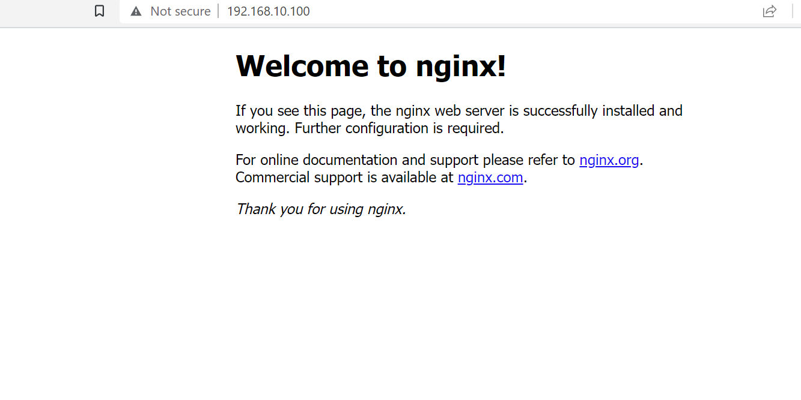
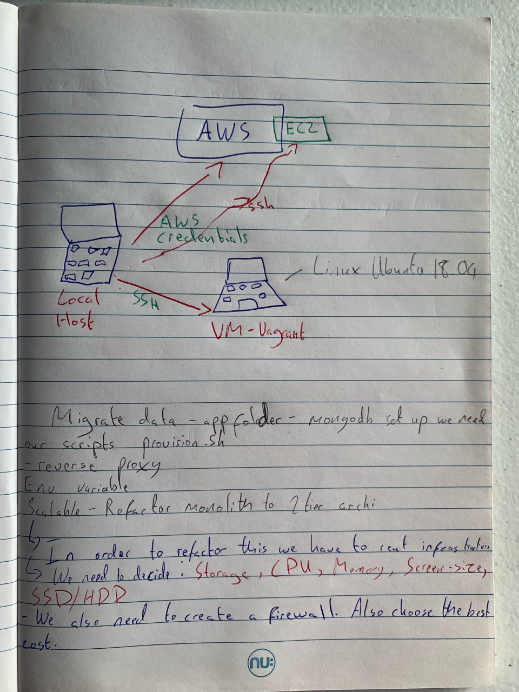

# Cloud_Computing_With_AWS

### Some of the basics steps to AWS

1. We must always use the the region Ireland which when using linux will be known as `eu-west-1`
2. Always keep our password private and safe and not share with anyone.

### Launching an EC2 instance and making a key pair:

### Creating a key pair:
1. Log in to AWS
2. Search ec2 and click on it
3. Click keypair
4. Generate and download the key
5. Move the key file to .ssh folder

1. We first select EC2 and create an instance.
2. we choose the name belal-tech201-app
3. Choose Ubuntu version 18.04
4. make sure we choose the correct key pair for us devops-tech201
5. Default VPC
6. Subnet Devops student 1a
7. auto assign IP: Enable.
8. Select security group option:
9. choose name belal-tech201-app
10. Secruity group rule select SSH and MY IP.
11. Secruity group rule 2 select HTTP and anywhere.
12. Security group rule 3 Custom TCP and anywhere.
13. Configure storage 8 GB is enough for us as we have little data.

### After configuring instance
`cd .ssh` this will allows us to get into our `.ssh` folder where our key pair is located 
we then use command `chmod 400 devops-tech201.pem` to make sure we have the correct permission for accessing the key 
and then `ssh -i "devops-tech201.pem" ubuntu@ec2-34-253-77-203.eu-west-1.compute.amazonaws.com` this means here is our key for the ubuntu linux machine located in eu-west on AWS.
after this we run `sudo apt-get install update` to make sure everything is updated 
and then we install nginx using`sudo apt-get install nginx`
and we should get this:

Just to  to Note: If you get a Connection timed out error - it is a port 22 issue. That means that your computer might have a Dynamic IP address which means it is always changing.

Go to your Instance`s Security.
then your Security Group.
then click edit your security group configurations: On port 22: Switch to My IP 

Should now work and you should be able to ssh in the instance through your bash terminal.

### Migrating our app folder to our EC2 Instance and running our app via the cloud:

We will do this using `scp` method which stands for secure copy it uses SSH protocol to transfer data between hosts this is the command I used

`scp -i devops-tech201.pem -r C:/Users/belal/OneDrive/Documents/Devops/tech201_virtualisation/tech201_virtualisation/environment ubuntu@ec2-34-253-77-203.eu-west-1.compute.amazonaws.com:/home/ubuntu`

It will take some time to copy everything, but after it is done use the command:

`ssh -i "devops-tech201.pem" ubuntu@ec2-34-253-77-203.eu-west-1.compute.amazonaws.com`
this will allow us to SSH into our EC2 instance.

Creating a 2 tier system:

App tier deployed-available on public IP

Create 2nd tier with required dependencies - Ubuntu 18.04, mongodob installed, change mongod.conf 0.0.0.0.
Need a security group for our database - allow 27017 from anywhere - allow only from app instance
Go back to the app and create an environment variable with the database endpoint
Relaunch the app
Securing architecture with firewalls
Separate firewall to app, seperate firewall to database
App is exposed to the world, database is exposed only to app, limiting access to database

### Cloning our EC2 instance `APP` to an AMI (Amazon Maching Image):

First: We need to start our instance then we open gitbash as Admin to go into our ssh folder and from their we `ssh` into our ec2 app machine to make sure it is working before we clone it( we can find the `ssh` command with key pair on AWS website in our instance if we click on instance ID then click `connect` we will locate it their). So once we acces our app and we see it is working we go back to our instance on AWS we select it and then we go to `Actions` in the top right and we select `Images` and then we select create an image and we enter in our details which is name tech201 and app and MAKE SURE we enter which ports we will use as those who come after will know or even us we might come back after several months and not remember which ports we were using, the lastly we select create image at the bottom and the image is now created.

## Cloud Computing and it's Importance:

## What is the Cloud

Simply put, cloud computing is the delivery of computing services—including servers, storage, databases, networking, software, analytics, and intelligence—over the Internet (“the cloud”) to offer faster innovation, flexible resources, and economies of scale. You typically pay only for cloud services you use, helping you lower your operating costs, run your infrastructure more efficiently, and scale as your business needs change.

### Benefits of cloud computing
Scalability
Cost saving
Flexibility
Disaster recovery
Security

BUSINESS SIDE:
Improved productivity
Competitive advantage

### Types of Cloud Computing

The three main types of cloud service are:

Infrastructure as a Service (IaaS): Provides virtualized computing resources, such as servers, storage, and networking, that can be rented and accessed over the internet. With IaaS, users are responsible for managing and securing their own applications and data.

Platform as a Service (PaaS): Provides a platform for building and deploying software applications without the need to manage the underlying infrastructure. PaaS typically includes application development tools, databases, and middleware.

Software as a Service (SaaS): Provides access to software applications over the internet, with the infrastructure and maintenance handled by the service provider. SaaS applications are typically accessed through a web browser.

The main differences between these three types of cloud service are the level of control and responsibility that the user has over the underlying infrastructure. With IaaS, the user has the most control over the infrastructure, but also has the most responsibility for managing it. With PaaS, the user has less control over the infrastructure, but can focus more on building and deploying applications. With SaaS, the user has the least control over the infrastructure, but can simply use the software application without worrying about infrastructure or maintenance.Additionally, there are different deployment models for cloud services, including public, private, and hybrid cloud. Public cloud services are available to the general public and are owned and operated by a third-party cloud provider. Private cloud services are used by a single organization and are typically managed in-house or by a third-party service provider. Hybrid cloud services are a combination of public and private cloud, providing the benefits of both.

### Different types of cloud:

### Operation expenditure vs Capital expenditure (OpEx vs CapEx).
Capital expenditure: Will need to by servers, cable, networking equipment whereas Operation expenditure allows us to forgo this and pay for what we use. Which provides companies with very high levels of flexibility. 

### Companies using it:
Many of these companies use it in a similar way, but Netflix for example uses CDN CloudFront to tell your geographic location and share content accordingly. Checks IP address. Sage maker for machine learning

### Summary:
To summarise, although there will always be a market for traditional computing, cloud computing has definitely changed the industry and the way companies approach their computing infrastructure. 

### Why use a two-tier architecture in AWS?

Scalability: The separation of the web server and database server allows each tier to be scaled independently, so you can handle more traffic by adding more web servers or increasing the database capacity.
High availability: If one tier goes down, the other tier can still operate, minimizing downtime.
Security: By separating the web server from the database server, you can implement more secure firewall rules and access controls.
When to use a two-tier architecture in AWS?

### When
When you expect high traffic or anticipate the need for scaling in the future.
When you need high availability and fault tolerance.
When you want to separate security and access controls between the front-end and back-end servers.

### Who
Who should use a two-tier architecture in AWS?

Web application developers who want to build scalable and reliable applications.
Organizations that need to meet strict uptime requirements or handle high traffic volumes.
Businesses that need to handle sensitive data and want to implement strict access controls.
How to create a two-tier architecture in AWS?

Here is a general overview of how to create a two-tier architecture in AWS:

Create an Amazon VPC to isolate your application within a virtual network.
Create an Amazon EC2 instance to host your web server and install the necessary software and dependencies.
Create an Amazon RDS instance to host your database server and configure the necessary security and access controls.
Connect the web server and database server using the appropriate networking protocols.
Test your application to ensure it's working as expected.

### How does this fit into DevOps? 
Implementing a two-tier architecture in AWS can fit into DevOps by enabling faster and more efficient application development and deployment processes. DevOps is an approach that aims to integrate development and operations teams to deliver software more rapidly and reliably.

The following are ways a two-tier architecture in AWS can fit into DevOps:

1. Automation: AWS offers various automation tools, such as AWS CloudFormation, AWS Elastic Beanstalk, and AWS CodeDeploy, that allow developers to quickly create and deploy infrastructure and applications. By automating the provisioning and deployment process, developers can focus on writing code, while operations teams can focus on maintaining the underlying infrastructure.

2. Continuous Integration and Continuous Deployment (CI/CD): A two-tier architecture can be integrated with CI/CD pipelines to automate the build, testing, and deployment process. This allows for faster and more reliable software delivery, with the ability to continuously deploy changes to the production environment.

3. Collaboration: By implementing a two-tier architecture in AWS, development and operations teams can work together more closely, with greater visibility into the infrastructure and code. This allows for better collaboration and communication, leading to faster problem-solving and improved application performance.

4. Monitoring: AWS provides a range of monitoring and logging tools, such as Amazon CloudWatch and AWS CloudTrail, that enable teams to monitor application performance, track changes, and troubleshoot issues. This can help teams quickly identify and resolve issues, leading to better application performance and reliability.

In summary, implementing a two-tier architecture in AWS can fit into DevOps by enabling automation, continuous delivery, collaboration, and monitoring. These practices can help teams deliver software more rapidly, reliably, and efficiently.

### How does this fit into agile/ SCRUM?

Implementing a two-tier architecture in AWS can fit into an Agile/Scrum methodology by enabling teams to deliver software more frequently and respond to changes more quickly. Agile/Scrum is an iterative and incremental approach to software development that emphasizes customer collaboration, flexibility, and continuous improvement.

The following are ways a two-tier architecture in AWS can fit into Agile/Scrum:

1. Iterative Development: Agile/Scrum involves iterative development, with frequent and incremental releases. A two-tier architecture in AWS allows teams to rapidly spin up new instances of web and database servers, enabling them to test and deploy new features more quickly.

2. Collaboration: Agile/Scrum emphasizes collaboration between developers, operations, and stakeholders. A two-tier architecture in AWS enables developers and operations teams to work more closely together, with greater visibility into the infrastructure and code. This can lead to better communication and problem-solving.

3. Continuous Integration and Continuous Deployment (CI/CD): Agile/Scrum requires continuous delivery of working software. A two-tier architecture in AWS can be integrated with CI/CD pipelines to automate the build, testing, and deployment process. This allows teams to rapidly deliver new features to customers.

4. Flexibility: Agile/Scrum requires teams to be flexible and adapt to changing requirements. A two-tier architecture in AWS provides the flexibility to quickly experiment and try new things. Developers can easily spin up new instances of web and database servers to test and deploy new features.

5. Retrospectives: Agile/Scrum involves frequent retrospectives to identify areas for improvement. AWS provides a range of monitoring and logging tools, such as Amazon CloudWatch and AWS CloudTrail, that enable teams to monitor application performance, track changes, and troubleshoot issues. This can help teams identify areas for improvement and implement changes more quickly.

In summary, implementing a two-tier architecture in AWS can fit into an Agile/Scrum methodology by enabling iterative development, collaboration, continuous delivery, flexibility, and retrospectives. These practices can help teams deliver software more rapidly, respond to changes more quickly, and continuously improve their processes.

