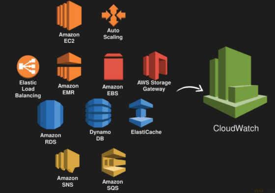

## How to set up an alarm for our EC2 app instance:

1. Open the AWS Management Console and navigate to the CloudWatch service.

2. In the left-hand menu, click on "Alarms".

3. Click on the "Create alarm" button.

4. Choose "EC2 metrics" as the source for your alarm, you may have to type this in the search column.

5. Select the "Per-Instance Metrics" (you may have to type this in the search column) option and then choose the instance you want to monitor."

6. Under "Select metric", choose "CPUUtilization".

7. Under "Conditions", you can specify the threshold at which you want the alarm to trigger. For example, you can set the threshold to trigger when CPU utilization is greater than 60%.

8. Under "Actions", you can choose what action you want to take when the alarm is triggered. For example, you can send an email notification, stop or terminate the instance.

9. We select create new topic, that way we are able to enter out email address and we need to choose a topic

10. Then we click create topic and we can test our alarm and see if we get an email, and we can confirm using our email.

11. Give your alarm a name and description, and then click "Create Alarm".

Once your alarm is created, you can view it in the CloudWatch Alarms console and manage it as needed.

### AWS CloudWatch:

AWS CloudWatch is a monitoring and alerting service provided by Amazon Web Services (AWS). It is designed to collect and track metrics, collect and monitor log files, and set alarms for metrics and log events.

CloudWatch provides the following features for monitoring and alerting:

1. Metrics: CloudWatch collects and tracks metrics for various AWS services, including EC2 instances, RDS databases, and Lambda functions. It also allows you to collect and track custom metrics for your own applications.

2. Dashboards: CloudWatch provides customizable dashboards that can display real-time metrics and allow you to quickly view the health of your applications.

3. Alarms: CloudWatch allows you to set alarms that trigger actions based on predefined thresholds or other criteria. For example, you can set an alarm to trigger an automatic scaling action when CPU usage reaches a certain threshold.

4. Logs: CloudWatch can collect and monitor log files from your applications and infrastructure, and provide real-time analysis and troubleshooting capabilities.

5. Events: CloudWatch Events allows you to respond to changes in your AWS environment, such as EC2 instance state changes, and trigger automated actions based on those events.

CloudWatch can help you to identify performance and availability issues in your AWS infrastructure, and take corrective actions before they impact your applications or customers. With its monitoring and alerting capabilities, CloudWatch can help you to maintain the health and stability of your applications and infrastructure.