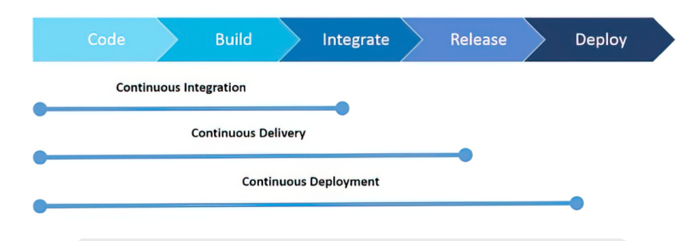
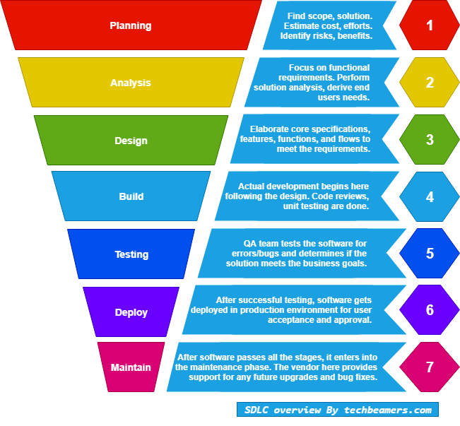

### Setting up a CI continuous integration

Firstly we log in the Jenkins once there `we create a job` give it a name and select `freestyle` then `ok` we give it a description so we know what we are using it for.

We then select `Discard old builds` the `max` we choose `3` the select `Github project` then we go to GitHub and copy and paste our HTTPS URL to `GitHub project` option in Jenkins next on Jenkins we select `restrict  where this project can run` and select `sparta` 
then in source code management we select `Git` and then in GitHub we copy our SSH URL and then paste it in `Repo URL` in Jenkins and then we go back to `GitHub` and make a key from with our repo that we are copying and then in `Build Environment` in Jenkins we select `Provide node and npm bin` option and we select `Sparta` then we select `Execute shell` in the Build option and enter `cd app/app` then `npm install` then `npm test` then we now go in to GitBash and start the process of making a key which is as follows.

`cd .ssh` into our SSH folder then we enter `ssh-keygen -t rsa -b 4096 -C "emailaddress` and then press enter. `b` means bytes here and `C` is us specifying the owner of the key.
Next we name our RSA key for example`github-key` then it will ask us for a passphrase we can leave this blank by pressing enter twice.

Next we go to our github account and go to settings and then click on `SSH and GPG keys` then we select new `SSH keys` then we give it a `Title` this title should refer to what the key is going to be used for for example Jenkins etc. Next we go back to Git Bash and git the public part of our key and copy and paste in into the key area of GitHub and then we select `Add SSH key` and we should see it added to our SSH keys.

Now in our Gitbash we are going to add a private key to our ssh by using the following command in the same Git Bash terminal with have been using. ``eval `ssh-agent -s`` we do this to install an agent you must use the little quote like symbol, we will then get a process I.D then we enter `ssh-add keyname` and it should tell us identity added then we enter `ssh -T git@github.com` to make sure it was successful.

Next we use `cat private_key_folder` copy its contents and paste it in to key section in Jenkins we it says `Add` and a key image once there we select a user name and select `enter directly` and then copy our private key.

we make sure we update the following:

`Branch specifier:` */main

`Build Triggers:` First iteration we will trigger it manually

B`uild environment:` Provide Node& npm check box(We provided all the plugins needed)

`Build steps: Execute shell`

Next in our GitBash we need to make make a change to our README.md file to see if CI is working once we do that using `nano README.md` and pushing it to our repo and we should see the changes made.

# What is CI/CD

CI stands for Continuous Integration. It is a software development practice that involves continuously merging code changes from multiple developers into a shared repository, and running automated tests to ensure that the code is functioning correctly.

CD stands for Continuous Delivery or Continuous Deployment. It is a software development practice that involves automating the process of delivering software to production.

CI/CD is a method to frequently deliver apps to customers by introducing automation into the stages of app development. The main concepts attributed to CI/CD are continuous integration, continuous delivery, and continuous deployment.

### What is the difference between CD & CDE use cases?

CD and CDE are two related but different terms in the context of software development:

CD stands for Continuous Delivery or Continuous Deployment. These are two related practices in software development that involve automating the process of delivering software to production.

CDE stands for Container Development Environment. This refers to a development environment that is built using containers, which are lightweight and portable units of software that can be used to package and deploy applications.

CD is an extension of CI and CDE is a further extension of CD. While CI focuses on helping developers by ensuring each bit of new code is bug-free and functional, CD is more about releasing updates and changes in a quick and safe manner. CDE is about creating a unified pipeline for software releases and increasing the velocity of delivery. Combining all three means that when new source code is committed it can be deployed to production automatically and within minutes (or even seconds!), assuming it passes all the relevant tests.

Example: Films during covid Continuous Delivery, planned, desiged, pushed, tested, passed. Unable to deploy to cinemas - needed to add more to movies to compete.

Example: Banks Service maintenance, app will be down. Ready to deploy but do not want to deploy on normal days and wait until nights/weekends.

Example: Can't stop service Amazon, Facebook, Netflix never down - Cannot afford to take service down and add feature and release. They use CICD to stay active.

Example: Facebook, Whatsapp, Instagram down due to CDE. A bug was used in the CDE that took down the servers and took 6 hours to fix, which resulted in massive loss of profits.

### Jenkins

Jenkins is a free and open source automation server. It helps automate the parts of software development related to building, testing, and deploying, facilitating continuous integration and continuous delivery.

### Why we should use it and other automation server:

Make sure to check cost-benefit analysis

Reduce risk
With a CI/CD pipeline, you can test and deploy code more frequently, giving testers the ability to detect issues as soon as they occur and to fix them immediately. You are essentially mitigating risks in real time.

Deliver faster
Organizations are moving toward releasing features multiple times a day. This is not an easy task; only a handful of companies like Netflix, Amazon, and Facebook have been able to achieve this goal. But, with a seamless CI/CD pipeline, multiple daily releases can be made a reality.

Teams can build, test and deploy features automatically with almost no manual intervention. This is accomplished using various tools, frameworks, and systems like Travis CI, Docker, Kubernetes, and LaunchDarkly.

Expand less manual effort
To align with the shift-left paradigm, we need automation right from the start. This is also a vital component of having a successful CI/CD implementation. Once you build features and check in code, tests should be automatically triggered to make sure that the new code does not break existing features and that the new features are working correctly.

After the tests run, the code gets deployed to different environments, including QA, staging and production. Throughout this process, you will be getting constant notifications through different channels, giving you plenty of information about the build, test and deploy cycles.

Generate extensive logs
One key aspect of observability is logging information. Logs are a rich source of information to understand what is happening beneath the UI and study application behavior.

With a CI/CD pipeline, extensive logging information is generated in each stage of the development process. There are various tools available to analyze these logs effectively and get immediate feedback about the system.

Make easier rollbacks
One of the biggest advantages of a CI/CD pipeline is you can roll back changes quickly. If any new code changes break the production application, you can immediately return the application to its previous state. Usually, the last successful build gets immediately deployed to prevent production outages.

Furthermore although there are over services available there are many reasons jenkins is better to use for example:

- Jenkins is designed to handle anything from a simple CI server to a complete CD hub.

- Spinnaker, a CD platform built for multicloud environments.

- GoCD, a CI/CD server with an emphasis on modeling and visualization.

- Concourse, "an open-source continuous thing-doer."

- Screwdriver, a build platform designed for CD.

- GitLab

- CircleCI

- Travis CL

- Atlassian Bamboo

This image illiustrates also some of the different CI/CD tools and benefits:

### What is git work flow:

Git is a popular version control system that allows developers to collaborate on code changes and track changes over time. Here's a basic overview of the Git workflow:

1. Create a repository: First, create a new Git repository to store your code. This can be done using the `git init` command.

2. Add files: Add files to the repository using the `git add` command. This will stage the changes for commit.

3. Commit changes: Commit the changes to the repository using the `git commit` command. This will permanently save the changes to the repository along with a message describing the changes.

4. Create a branch: Create a new branch using the `git branch` command. This allows you to work on changes in isolation without affecting the main codebase.

5. Make changes: Make changes to the code on the new branch. Use the git add and `git commit` commands to save your changes to the branch.

6. Merge changes: When you're ready to merge the changes from the branch back into the main codebase, use the `git merge` command. This will combine the changes and resolve any conflicts that may arise.

7. Push changes: Finally, push the changes to the remote repository using the `git push` command. This will make the changes available to other developers who are working on the same codebase.

This is a basic overview of the Git workflow, but there are many other Git commands and workflows that can be used depending on the specific project and team requirements.

### Jenkins work flow:

Jenkins is a popular open-source automation server that is used to automate various tasks in software development, including building, testing, and deploying code changes. Here's a high-level overview of the typical Jenkins workflow:

1. Configure Jenkins: First, set up a Jenkins server and configure it with the necessary plugins, credentials, and other settings. This can be done through the Jenkins web interface.

2. Create a job: Create a new Jenkins job to automate a specific task, such as building the code, running tests, or deploying changes. Jobs can be created using a graphical user interface or by writing code in a Jenkinsfile.

3. Trigger the job: Set up a trigger for the job, such as a code change in a Git repository, a time-based schedule, or a manual trigger.

4. Build the code: When the job is triggered, Jenkins will retrieve the latest code changes from the repository and build the code using the specified build tools, such as Maven or Gradle.

5. Run tests: After the code is built, Jenkins can run automated tests to verify that the code is working as expected. Jenkins can integrate with a variety of testing frameworks, including JUnit, Selenium, and Cucumber.

6. Deploy changes: If the tests pass, Jenkins can deploy the code changes to a staging or production environment. Jenkins can deploy changes using a variety of methods, including copying files to a server, using a configuration management tool like Ansible, or deploying to a cloud platform like AWS or Google Cloud Platform.

7. Monitor the job: Monitor the status of the job using the Jenkins web interface. If the job fails, Jenkins can send notifications to the appropriate stakeholders, such as developers, testers, or operations staff.

This is a basic overview of the Jenkins workflow, but there are many other features and plugins that can be used to customize and extend the Jenkins automation capabilities.

### SDLC work flow stages:

This image shows us a rough overview of a SDLC work and it's different stage:

SDLC (Software Development Life Cycle) is a process used by software development teams to design, develop, test, and deploy software applications. Here are the typical stages of an SDLC workflow:

1. Planning: In this stage, the project team identifies the project scope, goals, and requirements. They also consider the feasibility of the project, the budget, and the timeline.

2. Analysis: In this stage, the team analyzes the requirements gathered in the planning stage to determine what the software application should do. They also determine what resources will be needed for the project.

3. Design: In this stage, the team creates a detailed design of the software application. This includes creating system architecture, software specifications, data flow diagrams, and other documentation.

4. Implementation: In this stage, the team begins coding the software application based on the design specifications. This stage includes writing code, building interfaces, integrating data, and creating data structures.

5. Testing: In this stage, the team tests the software application to ensure it meets the specifications outlined in the requirements. This includes functional testing, integration testing, performance testing, and other types of testing.

6. Deployment: In this stage, the team deploys the software application to production environments. This includes installing and configuring the software on servers, testing it in a production-like environment, and training users.

7. Maintenance: In this stage, the team maintains the software application to ensure it continues to meet the needs of users. This includes fixing bugs, addressing security vulnerabilities, and updating the software to support new hardware or software platforms.

These stages are often iterative, meaning that the team may revisit earlier stages as they refine the software application based on feedback from users or other stakeholders. The exact SDLC workflow may vary depending on the specific project and team requirements.