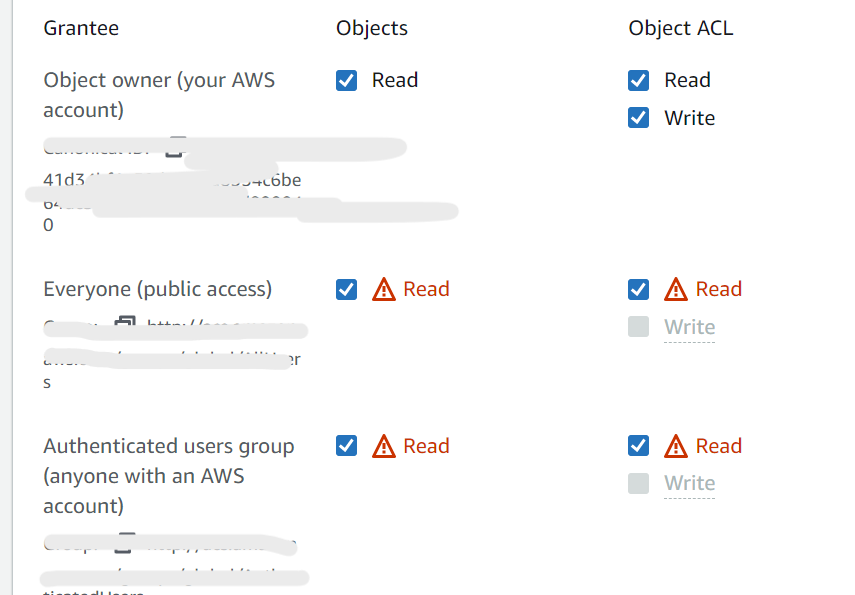

## Creating and S3 Bucket:

First we go onto the AWS Website then we select `Amazon EC2` then we select `Launch Instance` we give our bucket a name using `name-group-s3` model, we then select `Ubuntu version 18` then we select `instance type` then next we choose our `key pair` then in the `Network settings` we select `Allow SSH traffic from` and `Allow HTTP traffic from the internet` we then select edit to make sure we have SSH Oon port 22 and HTTP on port 80. 
We check every is correct in the summary the we create the instance.

Next we move to gitbash and we SSH in to our S3 Bucket instance

we run `sudo apt-get update` and then `upgrade` then we run `sudo apt-get install python` then we run `alias python=python3` this way we use version 3 of python rather than the default version 2.
then we run `sudo apt install python3-pip` then `aws configure` then from here we will be prompted to enter our information firstly with `access key` ,then `Secret key`, then `region` then we choose `json` for the last option.

Once we we have access to our S3 bucket we now need to make a bucket using the `aws s3 mb s3://belal-tech201` command then we go onto our AWS account and confirm it has been made. Then we make a file in git bash as follows `touch filename.txt` once this has been made we now move it to our S3 Bucket using the following command `aws s3 cp test.txt s3://belal-tech201`: Here we are telling it we would like to copy this file into our s3 bucket named `belel-tech201` 

Next in order to access this we need to change permissions we simply do this by going to our S3 bucket on the AWS menu we select our `Bucket` we select our `file` we go to permissions we `edit` permission to read by selecting the following as shown in the image.

We then `save changes` and now we can see our file if we click on the `object URL` found `properties` section of our file and it should look like this:

Furthermore in this image below we can see a summary of the whole process and how we used our local host to SSH into our S3 Instance and then from the we were able to use Git Bash to install all the required dependencies and then creat our S3 Bucket and then our file.
