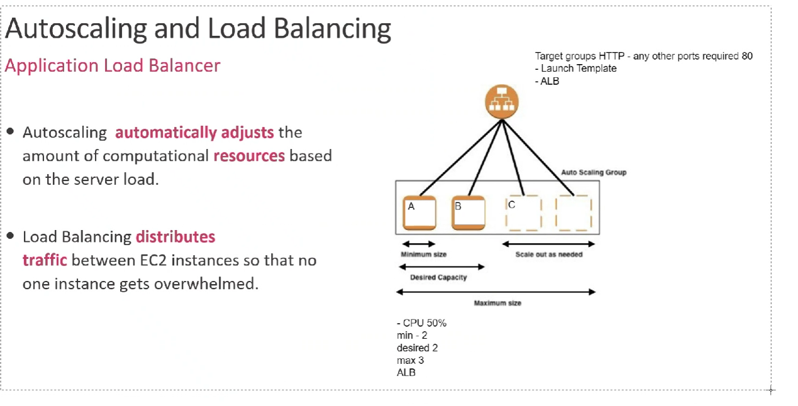

## Autoscaling and load balancer (policies, target groups, template, ALB)

AWS Auto Scaling is a service that assists organizations in supervising AWS-based software and infrastructure. The service automatically adjusts capacity to maintain steady, predictable performance at the lowest possible cost. 

AWS Auto Scaling can increase and/or decrease the capacity of AWS services to optimize costs. The service will monitor all scalable cloud services and resources related to a user’s applications

### What is load balancing?

High-traffic applications and websites can serve thousands of users internationally each day. Load balancing describes the process of distributing workload evenly across multiple servers. A load balance sends requests to servers that can efficiently handle them to optimize speed and performance while preventing downtime.

For a long time, load balancers existed in the form of hardware in private data centers. However, thanks to the popularization of the cloud, load balancers have evolved. You may hear them referred to as application delivery controllers (ADCs).

They now provide additional capabilities such as security, acceleration, and authentication. In the context of Amazon EC2, a load balancer will distribute traffic among EC2 instances. The load balancer will spread a load across multiple downstream instances while exposing only a single point of access (DNS) to your application. Additionally, the load balancer will perform regular health checks on instances to ensure they are working correctly.

### Autoscaling Policy:

In Simple Autoscaling Policy, you define the threshold value and upper bound. The alarm monitors the metric values. When the metric value breaches the threshold, the scaling policy acts. The instances are added or removed as per the policy. The Amazon Web Services has modified the Autoscaling Policies and new features have been introduced. It now lets you scale in and scale out your instances in percentage terms of the running instances. You can now define multiple scaling policies in a single AutoScaling Policy based on your metric values. Below is an example of an Auto scaling policy.

### What is target group in Auto Scaling?
Target Groups: Target group is used to route network traffic via specified protocols and ports to specified instances and also to allow accessing many applications running on different ports but the same instance. Autoscaling Group: Autoscaling Group(ASG) is basically a group of identical instances.

### AWS Autoscale using a template:

- Create an Auto Scaling group using a launch template:

When you create an Auto Scaling group, you must specify the necessary information to configure the Amazon EC2 instances, the Availability Zones and VPC subnets for the instances, the desired capacity, and the minimum and maximum capacity limits.

To configure Amazon EC2 instances that are launched by your Auto Scaling group, you can specify a launch template or a launch configuration. The following procedure demonstrates how to create an Auto Scaling group using a launch template.

To update the configuration of the EC2 instances after the group is created, you can create a new version of the launch template. After you change the launch template for an Auto Scaling group, any new instances are launched using the new configuration options, but existing instances are not affected. To update the existing instances, terminate them so that they are replaced by your Auto Scaling group, or allow auto scaling to gradually replace older instances with newer instances based on your termination policies

Before you can create an Auto Scaling group using a launch template, you must create a launch template with the parameters required to launch an EC2 instance. These parameters include the ID of the Amazon Machine Image (AMI) and an instance type.

A launch template provides full functionality for Amazon EC2 Auto Scaling and also newer features of Amazon EC2 such as the current generation of Amazon EBS Provisioned IOPS volumes (io2), EBS volume tagging, T2 Unlimited instances, Elastic Inference, and Dedicated Hosts.

### What is an ALB load balancer?
Application Load Balancer components

A load balancer serves as the single point of contact for clients. The load balancer distributes incoming application traffic across multiple targets, such as EC2 instances, in multiple Availability Zones. This increases the availability of your application.

In this diagram below we can get a visual sense of how Auto scaling and a load balancer will work together, aautoscaling will adjust the amount of compute power and load balancer will distrubute EC2 instance so no one instance is overwhelmed.
